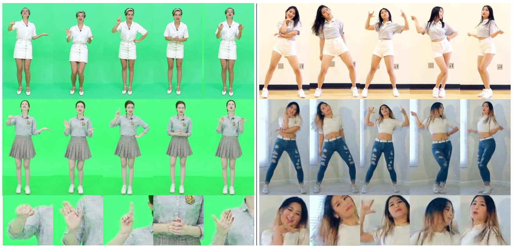

# Human Motion Transfer with 3D Constraints and Detail Enhancement


## Abstract
We propose a new method for realistic human motion transfer using a generative adversarial network (GAN), which generates a motion video of a target character imitating actions of a source character, while maintaining high authenticity of the generated results. We tackle the problem by decoupling and recombining the posture information and appearance information of both the source and target characters. The innovation of our approach lies in the use of the projection of a reconstructed 3D human model as the condition of GAN to better maintain the structural integrity of transfer results in different poses. We further introduce a detail enhancement net to enhance the details of transfer results by exploiting the details in real source frames. Extensive experiments show that our approach yields better results both qualitatively and quantitatively than the state-of-the-art methods.

## Dependencies
* [Jittor](https://github.com/Jittor/jittor)
* opencv-python
* dominate
* scipy
* tensorflow (for tensorboard)

## Dataset
Our approach takes two single-character motion video as input, i.e., the `source` and `target` used for motion transfer. The dataeset should be prepared like below
```
dataset
├──source
|   ├── all_512
|   ├── openpose_img_512_norm
|   └── img_obj_smooth_512_norm
└──target
    ├── all_512
    ├── openpose_img_512_norm
    └── img_obj_smooth_512_norm


```
Here, the `all_512` folder contains the extracted video frames. In our experiment, each frame is cropped to $1024x512$. The `openpose_img_512_norm` folder is composed of human skeleton images,  which are rendered by connecting Openpose[https://github.com/CMU-Perceptual-Computing-Lab/openpose] detecting results. The `img_obj_smooth_512_norm` folder is consisted of the projection of reconstructed human mesh with [MonocularTotalCapture](https://github.com/CMU-Perceptual-Computing-Lab/MonocularTotalCapture), while the vertex color represents corresponding Laplacian feature. Please refer to the [paper](https://ieeexplore.ieee.org/document/9868156) for more details. 


## Training

```
bash run.sh $source $target
```
Note that the vairables `datadir`, `codedir`, `trainname` and `datasetname` can be set in `run.sh`, since they are always consistent for different characters. The `$source` and `$target` denotes the dataset folder name for corresponding characters.


## Test

```
bash test.sh $source $target
```
The test script has similar arguments with traning script.